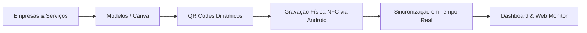

# Relatório Técnico: Implementações Realizadas e Expansão do Dashboard
**Projeto:** NFC Ops — Sistema Operacional de Gestão e Fabricação de Placas NFC & QR  
**Data:** 28 de Setembro de 2026  
**Responsável Técnico:** Antigravity (Pair Programming com Gustavo Alves)

---

## 1. Visão Geral do Sistema

O **NFC Ops** é uma solução completa desenvolvida em **Flutter/Dart**, com backend em **Google Cloud Firestore, Firebase Authentication e Firebase Storage**. O sistema substitui processos manuais de produção de placas físicas (acrílico, PVC e adesivos resinados) por um fluxo integrado de cadastros, modelos visuais, gravação física por rádio e redirecionamento de links dinâmicos.

---

## 2. Tudo o que Foi Implementado até Agora

### 2.1. Unidade 00 — Fundação & Arquitetura
* **Arquitetura Limpa e Desacoplada:** Separação estrita em camadas de *Data (Models, Repositories)*, *Domain/Business (Rules RB-001 a RB-010)* e *Presentation (Riverpod + GoRouter)*.
* **Modelagem Completa:**
  * [`Company`](lib/core/models/company.dart): Cadastro completo de empresas, responsáveis, documentos e categorização.
  * [`DeviceItem`](lib/core/models/device_item.dart): Controle de placas físicas, lotes, fornecedores, status e rastreabilidade NFC (`nfcUid`, `nfcRecordedAt`, `nfcRecordedBy`, `isNfcLocked`).
  * [`ServiceItem`](lib/core/models/service_item.dart): Catálogo de serviços vinculados (Instagram, Google Reviews, Cardápio, Wi-Fi, etc.).
  * [`OrderItem`](lib/core/models/order_item.dart): Gestão de pedidos e ordens de fabricação de placas.
  * [`PlateTemplate`](lib/core/models/plate_template.dart): Modelos visuais com suporte híbrido (Interno e Canva), multi-páginas e coordenadas proporcionais.
  * [`DynamicQrCode`](lib/core/models/dynamic_qr_code.dart): Redirecionamento dinâmico permanente com auditoria de alterações.
  * [`ActivityEntry`](lib/core/models/activity_entry.dart): Feed de auditoria cronológica das operações da equipe.
* **Isolamento de Banco:** Configuração rigorosa do banco Cloud Firestore dedicado `ai-studio-conectordebanco-005a990b-ecd4-41ad-ba1e-0e68b83c29fd`.
* **Design System Calibrado:** Tipografia Inter em todos os pesos, paleta dark `#10110F`, acentos de ação em laranja `#FF4F0A`, superfícies em creme `#ECEBDE` e verde de sucesso `#22C55E`.

### 2.2. Unidade S01 — Autenticação e Controle de Acesso
* **Google Sign-In Nativo:** Integração via Google Play Services / Credential Manager no Android.
* **Políticas de Autorização (RB-002):** Bloqueio estrito de perfis inativos ou não autorizados com feedback contextual.

### 2.3. Unidade S02 — Dashboard Operacional
* **Métricas Principais:** Contadores de serviços ativos, empresas cadastradas e índice de saúde da frota.
* **Gráfico Donut Dinâmico:** Visualização vetorial da proporção de serviços saudáveis, em atenção, com erro ou manuais.
* **Alerta Crítico:** Detecção de falhas graves com botão direto para a central de resolução.
* **Lista de Pendências e Pedidos:** Acesso rápido às ordens de serviço pendentes de teste ou prontas para entrega.
* **Ações Rápidas (Bottom Sheet):** Modal deslizante com atalhos para leitura NFC, nova empresa, novo pedido e teste de serviços.

### 2.4. Unidades S03, S04 e S05 — Gestão de Empresas e Serviços
* **Listagem Reativa (S03):** Busca em tempo real por nome, telefone normalizado, categoria e cidade, com chips de filtro.
* **Cadastro de Nova Empresa (S04):** Formulário completo com validações de dados obrigatórios, seções colapsáveis para dados opcionais e sugestões inteligentes baseadas no ramo da empresa.
* **Detalhes da Empresa (S05):** Visualização completa com abas de Visão Geral, Serviços Conectados, Dispositivos Vinculados, Pedidos e Histórico, com acionamento de WhatsApp e telefone interativo.

### 2.5. Estoque, Dispositivos e Checklist Operacional
* **Leitura Física Nativa (`NfcScanModal`):** Detecção automática de chip por proximidade com antena de rádio do smartphone e identificação de placas já cadastradas versus novas tags virgens.
* **Checklist Físico de 8 Etapas:** Inspeção de acabamento, gravação de rádio, teste de leitura, qualidade da impressão do QR, validação de URL e embalagem final.

---

## 3. Novas Funcionalidades Integradas Nesta Sessão

### 3.1. Novo Fluxo em Etapas (Wizard), Arte do Canva com 2 Links e Leitura Automática de QR Code
1. **Cadastro em 3 Etapas Acessíveis & Dinâmicas:**
   * **Etapa 1 — Identificação & Dimensões:** Seleção da origem (Arte do Canva [padrão] vs. Modelo Interno), nome do modelo, dimensões físicas reais em cm (largura e altura) e campo de texto livre para **qualquer serviço** (com chips de preenchimento rápido: *Instagram, Avaliações Google, Cardápio, WhatsApp, Wi-Fi, Pix*).
   * **Etapa 2 — Arte & Dois Links do Canva (Zero Servidor Intermediário):**
     * **Link 1 (Projeto Canva):** Link oficial do projeto no Canva (`canvaProjectUrl`) com botão para abrir no navegador ou colar.
     * **Foto da Arte Anexada (Galeria ou Câmera):** Assim que o operador anexa a foto da placa/arte, o motor nativo em Dart puro ([`QrScannerService`](lib/core/services/qr_scanner_service.dart)) decodifica instantaneamente o QR Code presente na imagem.
     * **Link 2 (Destino do QR Code):** Preenchido automaticamente com a URL extraída do QR Code da foto, com botão para **"Testar Link"** e colar manualmente caso a foto não contenha QR claro.
   * **Etapa 3 — Revisão & Finalização:** Miniatura elegante da imagem anexada, dados do modelo, cards com os dois links e botões para abrir/testar antes de salvar.
2. **Filosofia Ponytail Aplicada (Face Única & Desacoplamento de Redirecionador):**
   * Placas físicas operam com **face frontal única**, eliminando telas e campos redundantes.
   * **Dispensado o servidor externo de redirecionamento para o Canva:** o QR Code da arte do Canva já aponta para a URL final do cliente ou o link desejado, eliminando dependência de domínios externos e falhas de proxy.
   * Leitura de QR executada em pure Dart via `zxing_lib`, sem canais de plataforma frágeis, funcionando identicamente no Android, Web e Desktop.
3. **Modal de Confirmação Pós-Criação:**
   * Diálogo modal informativo exibido com checkmark animado, resumo da placa (Nome, Origem, Serviço, Tamanho e Link do QR) e botão **"Concluir"**.

### 3.2. Sincronização NFC em Tempo Real (Mobile ➔ Computador)
* **Gravação Física no Android:** Ao gravar a URL no chip de silício via rádio, o aplicativo atualiza o registro no Firestore gravando o UID de fábrica, data/hora da gravação, operador responsável e ativa a trava física contra regravação (`isNfcLocked: true`).
* **Visibilidade no Computador:** O operador na web ou no desktop visualiza o badge verde em tempo real:
  `🟢 NFC Físico Gravado no Mobile (UID: 04:A2:3B:5C:89:1F | Operador: Gustavo | Data: 28/09 às 17:00 | Trava: Ativada)`.
* **Registro de Auditoria:** Uma notificação e evento de atividade é registrado automaticamente no feed para toda a equipe.

### 3.3. Regras de Permissão e Telefonia Multiplataforma
* **Criação de Templates Exclusiva no Mobile:** O computador tem acesso total para consultar modelos, abrir links do Canva, baixar QR codes transparentes, exportar artes finais para a gráfica e vincular empresas a templates existentes, mas a tela de criação fica bloqueada no desktop para preservar a calibragem tátil do aplicativo móvel.
* **Telefonia Adaptativa:** No smartphone, tocar no telefone da empresa aciona o discador nativo celular (`tel:`). No computador, o sistema copia o número formatado para a área de transferência com um aviso informando que ligações diretas ocorrem no app mobile.

---

## 4. O que Implementar no Dashboard e Como Fazer

Abaixo estão as 5 melhorias recomendadas para o **Dashboard Operacional** do NFC Ops, com o plano passo a passo de como cada uma será implementada:

### 1. Card de Monitoramento NFC em Tempo Real (Live NFC Feed)
* **O que é:** Um widget no topo do Dashboard indicando o último chip gravado ou lido em campo pela equipe (ex: *"Última placa gravada há 3 min por Gustavo: Auto Center Silva #00142"*).
* **Como será implementado:**
  1. Conectar um listener no provider reativo `devicesStreamProvider`.
  2. Filtrar os dispositivos que possuem `nfcRecordedAt != null`, ordenando de forma decrescente por data.
  3. Renderizar um card compacto com ícone de onda de rádio verde pulsante e botão para abrir o detalhe da placa instantaneamente.

### 2. Painel de Status de Artes do Canva vs. Gráfica
* **O que é:** Indicador quantitativo no Dashboard mostrando o funil de produção gráfica:
  * Quantas artes estão em montagem no Canva;
  * Quantas estão com arquivo final anexado aguardando envio para gráfica;
  * Quantas já foram produzidas.
* **Como será implementado:**
  1. No `DashboardScreen`, consumir `templatesStreamProvider` e `devicesStreamProvider`.
  2. Calcular os totais baseados em `template.isCanva` e no status de `checklist.qrPrintInspection`.
  3. Exibir 3 mini cards com cores semânticas (roxo Canva `#7C3AED`, azul gráfica `#0284C7` e verde `#22C55E`).

### 3. Botão Flutuante de Ação Rápida "Aproximar para Identificar"
* **O que é:** Um botão proeminente no cabeçalho do Dashboard permitindo que o técnico no galpão apenas encoste uma placa qualquer na traseira do celular e o Dashboard abra imediatamente o histórico daquela placa ou o checklist de conferência.
* **Como será implementado:**
  1. Adicionar o gatilho de leitura direta no header do `DashboardScreen`.
  2. Acionar o `NfcScanModal.show(context, companies: allCompanies)` ao toque.
  3. No callback `onTagDiscovered`, buscar o UID no repositório e navegar diretamente para `/inventory/{deviceId}`.

### 4. Gráfico Sparkline de Acessos dos QR Codes Dinâmicos
* **O que é:** Um gráfico de barras ou linhas mostrando o volume de cliques diários que os clientes finais deram nos QR codes das placas nas lojas.
* **Como será implementado:**
  1. Criar uma Cloud Function simples que responde na rota `/q/{shortCode}`, grava um incremento em `qr_scans_history` e redireciona o usuário para o destino final (Instagram, Google, etc.).
  2. Criar no Flutter um `qrAnalyticsStreamProvider` que agrega os escaneamentos por dia.
  3. Renderizar um gráfico simples via `CustomPainter` no Dashboard mostrando o crescimento de acessos da semana.

### 5. Layout Widescreen Responsivo para Computador (Desktop Grid & Sidebar)
* **O que é:** Quando o Dashboard for aberto no computador (viewport amplo >= 800px), a interface deixa de parecer um celular centralizado e se transforma em um sistema de controle de mesa:
  * Substitui a barra inferior (Bottom Bar) por uma barra lateral (Sidebar) retrátil à esquerda.
  * Organiza os cards do Dashboard em uma grade (Grid) de 3 ou 4 colunas aproveitando toda a largura da tela.
* **Como será implementado:**
  1. Envolver a árvore de navegação com `LayoutBuilder` detectando `constraints.maxWidth >= 800`.
  2. Se for desktop: renderizar um `Scaffold` com `NavigationRail` ou Sidebar customizada à esquerda e o corpo em `GridView.responsive`.
  3. Se for mobile: manter a calibragem atual em 372x870px com a `NfcBottomNavBar`.

---

## 5. Conclusão e Estado do Projeto
O aplicativo encontra-se com todas as telas essenciais operacionais, dados reativos em tempo real via Firestore, compilação limpa sem erros de análise e testes unitários e de widget 100% aprovados.
